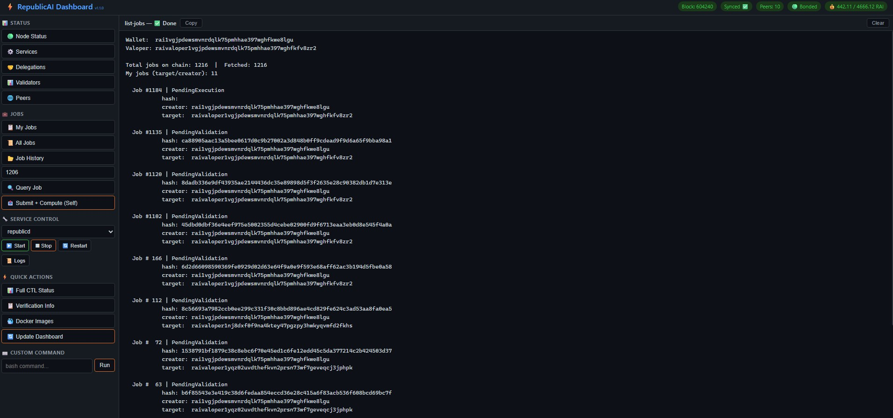
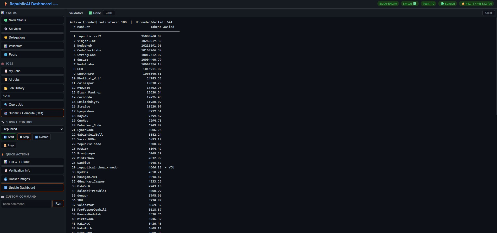
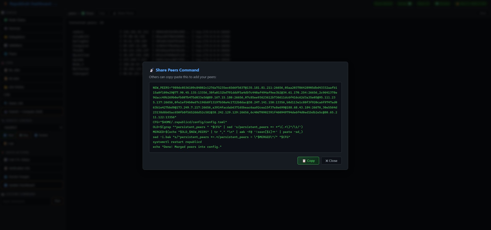

# RepublicAI Dashboard

Lightweight web dashboard for managing a RepublicAI validator + GPU compute node.  
Runs **inside WSL / Linux** for direct access to `republicd`, `docker`, `systemctl`.

  

## Preview





## Features

| Category | Actions |
|------------|---------|
| **Status** | Node health, services, delegations, validators (100 bonded w/ pagination), peers |
| **Share Peers** | One-click shareable command — merge + dedup peers into another node's config |
| **Jobs** | List jobs (full hashes + creator/target), query by ID, submit+compute, find TX hash |
| **Services** | Start / Stop / Restart / Logs for any systemd service |
| **Quick Actions** | Full CTL status, verification info, docker images, re-detect config |
| **Custom** | Run any bash command directly |

- ⚡ **Real-time output** via Server-Sent Events (SSE)
- 🖥️ **Health bar** auto-refreshes on load (block height, sync, peers, balance)
- � **Share Peers** button with copy-to-clipboard modal (merge + dedup, no peer loss)
- �🔧 **Auto-detect** node configuration (ports, wallet, home directory)
- � **Python scripts** — robust subprocess handling, env-var driven, no bash fragility
- �🔧 **Zero build step** — vanilla HTML/CSS/JS frontend

---

## Setup

### Prerequisites

- **Linux / WSL** with `republicd` already running
- **Node.js 22+** — install if not present:
  ```bash
  curl -fsSL https://deb.nodesource.com/setup_22.x | bash -
  apt-get install -y nodejs
  ```
- **Python 3.7+** (for dashboard scripts and config auto-detection)
  ```bash
  # Check version (most Linux distros include Python 3.8+)
  python3 --version
  
  # Install if missing (Ubuntu/Debian)
  apt-get install -y python3
  ```
- **Git**
  ```bash
  apt-get install -y git
  ```

### 1. Clone

```bash
git clone https://github.com/billythekidz/republicai-dashboard.git ~/republicai-dashboard
cd ~/republicai-dashboard
npm install
```

### 2. Auto-Detect Configuration

The dashboard auto-detects your node configuration on first launch. It scans:

1. **Running `republicd` process** — reads `--home` flag or infers from process user
2. **Systemd service files** — checks `ExecStart` and `User=` in `republicd*.service`
3. **Environment variables** — `REPUBLICD_HOME` / `DAEMON_HOME`
4. **Common paths** — `/root/.republicd`, `/home/<user>/.republicd`
5. **Alternative locations** — `/opt/republicd`, `/var/lib/republicd`, `/data/.republicd`

To run detection manually:

```bash
# Full auto-detect (scans all sources)
python3 detect-config.py

# Explicit home directory
python3 detect-config.py --home /home/theaux/.republicd

# Just scan without generating config
python3 detect-config.py --scan-only
```

This generates `config.json` (gitignored) with detected ports, wallet, endpoints, and services.

### 3. Run

#### Option A: Run directly

```bash
cd ~/republicai-dashboard
node server.js
# → http://localhost:3847
```

#### Option B: Install as systemd service (recommended)

```bash
# Copy the service file
cp ~/republicai-dashboard/republic-dashboard.service /etc/systemd/system/

# If your dashboard is NOT at /root/republicai-dashboard, edit the paths:
# nano /etc/systemd/system/republic-dashboard.service
#   ExecStart=/usr/bin/node /home/<user>/republicai-dashboard/server.js
#   WorkingDirectory=/home/<user>/republicai-dashboard

# Enable and start
systemctl daemon-reload
systemctl enable --now republic-dashboard

# Verify
systemctl status republic-dashboard
```

The service will:
- Auto-start on boot
- Restart on failure (5s delay)
- Auto-detect config if `config.json` is missing

---

## Architecture

```
~/republicai-dashboard/
├── server.js              # Express server (SSE + command registry)
├── detect-config.py       # Auto-detect node config (ports, wallet, home)
├── config.json            # Generated config (gitignored, per-node)
├── republic-dashboard.service  # Systemd unit file
├── public/
│   ├── index.html         # Dashboard UI
│   ├── style.css          # Dark theme
│   └── app.js             # Client-side SSE + health bar
└── scripts/               # Python + Bash scripts (env vars injected from config)
    ├── status.py           # Node health + JSON for health bar header
    ├── services.py         # Systemd + Docker status
    ├── delegations.py      # Staking delegations
    ├── validators.py       # All bonded validators (paginated, up to 200/page)
    ├── peers.py            # Connected peers via RPC
    ├── share-peers.py      # Generate merge+dedup peer sharing command
    ├── list-jobs.py        # Compute jobs (full hash, creator, target)
    ├── all-jobs.py         # All chain jobs (newest first, --reverse)
    └── compute-job.sh      # Full pipeline: submit → inference → result
```

## Configuration

### Auto-detected `config.json`

Generated by `detect-config.py`, contains:

```json
{
  "node": { "home": "/root/.republicd", "moniker": "my-node", "chain_id": "raitestnet_77701-1" },
  "ports": { "rpc": 26657, "p2p": 26656, "api": 1317, "grpc": 9090 },
  "wallet": { "name": "my-wallet", "address": "rai1...", "valoper": "raivaloper1..." },
  "services": ["republicd", "republic-sidecar", "republic-autocompute", ...],
  "endpoints": { "rpc": "tcp://localhost:26657", "api": "http://localhost:1317" }
}
```

### Environment Variables

Scripts receive these env vars from `config.json` (injected by `server.js`):

| Variable | Description | Example |
|----------|-------------|---------|
| `NODE_HOME` | republicd home directory | `/root/.republicd` |
| `NODE_RPC` | RPC endpoint (tcp) | `tcp://localhost:26657` |
| `NODE_RPC_HTTP` | RPC endpoint (http) | `http://localhost:26657` |
| `NODE_RPC_PORT` | RPC port | `26657` |
| `NODE_API` | API endpoint | `http://localhost:1317` |
| `NODE_GRPC` | gRPC endpoint | `localhost:9090` |
| `WALLET_NAME` | Default wallet name | `my-wallet` |
| `WALLET_ADDRESS` | Wallet bech32 address | `rai1...` |
| `WALLET_VALOPER` | Validator operator address | `raivaloper1...` |
| `KEYRING_BACKEND` | Keyring backend | `test` |
| `DOCKER_INFERENCE_IMAGE` | Docker inference image | `republic-llm-inference:latest` |

### Custom Port

Edit the top of `server.js`:
```js
const PORT = 3847;
```

### Re-detect Config

If you change ports or move your node home:

```bash
# CLI
python3 detect-config.py

# Or from the dashboard UI: Quick Actions → Re-detect Config
```

---

## Update

```bash
cd ~/republicai-dashboard
git pull
systemctl restart republic-dashboard  # if using systemd
```

## License

MIT
